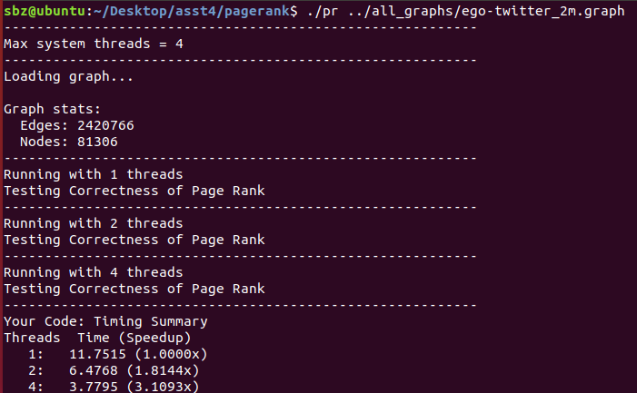
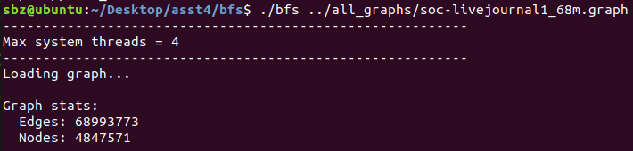
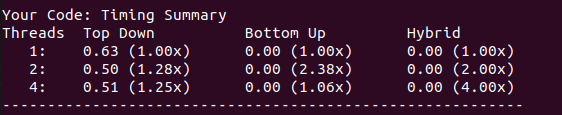
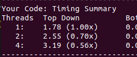

## cs149_asst4

​	使用OpenMP加速**pagerank**算法和各种**BFS**算法

## Part 1: Warm up: Implementing Page Rank

​	实现Page Rank算法并使用OpenMP加速。

​	Page Rank算法会不停迭代计算网络图中每个节点（网站）的权重，并将每轮迭代前后的权重相减,若计算出的 global_diff 小于某个阈值则算法收敛：

```c++
//global_diff = sum over all nodes vi { abs(score_new[vi] - score_old[vi]) };
//converged = (global_diff < convergence)
```

​	根据文档中对算法的描述实现page rannk算法，用OpenMP并行计算每个点的新权重，并使用#pragma omp parallel for reduction(+:global_diff)将计算出的权重差累积到共享变量 global_diff 中。

```c++
// pageRank --
//
// g:           graph to process (see common/graph.h)
// solution:    array of per-vertex vertex scores (length of array is num_nodes(g))
// damping:     page-rank algorithm's damping parameter
// convergence: page-rank algorithm's convergence threshold
//
void pageRank(Graph g, double* solution, double damping, double convergence)
{


  // initialize vertex weights to uniform probability. Double
  // precision scores are used to avoid underflow for large graphs
  int numNodes = num_nodes(g);
  double equal_prob = 1.0 / numNodes;
  double *score_new=new double[numNodes];
  for (int i = 0; i < numNodes; ++i) {
    solution[i] = equal_prob;
  }

  bool converged=false;
  Vertex* nullout=new Vertex[numNodes];
  int nulloutsize=0;
  for(Vertex v=0;v<numNodes;++v){
    if(outgoing_size(g,v)==0){
      nullout[nulloutsize]=v;
      ++nulloutsize;
    }
  }
  while(!converged){
    double global_diff=0.0;
    #pragma omp parallel for reduction(+:global_diff)
    for(Vertex vi=0;vi<numNodes;++vi){
      score_new[vi]=0.0;
      const Vertex* start = incoming_begin(g, vi);
      const Vertex* end = incoming_end(g, vi);
      for (const Vertex* v=start; v!=end; v++){
        score_new[vi]+=solution[*v]/outgoing_size(g,*v);
      }
      score_new[vi]=(damping*score_new[vi])+(1.0-damping)/numNodes;
      for( int i=0;i<nulloutsize;i++){
        score_new[vi]+= damping*solution[nullout[i]]/numNodes;
      }
      global_diff+=abs(score_new[vi]-solution[vi]);
      
    }
    converged=(global_diff<convergence);
    memcpy(solution,score_new,numNodes*sizeof(double));
  }
  free(nullout);
  free(score_new);
}
```

使用 omp_set_num_threads(thread_count) 设置线程数量，最后在不同线程下page_rank算法的运行时间如下：



可以看到运行速度基本上是与线程数成正比的。

## Part 2: Parallel "Top Down" Breadth-First Search 

​	题目中顺序计算自顶向下的BFS算法的串行计算代码已经给出，要求用openMP加速该算法。

​	操作比较简单，在最外层循环加上# pragma omp parallel for即可，但有一点需要注意，

​	int index=new_frontier->count++;这一句如果被所有线程不加限制地异步计算会导致count计数发生错误。所以需要加上#pragma omp critical限制同时只能有一条指令执行该语句。

​	最后修改的代码如下：

```c++
void top_down_step(
    Graph g,
    vertex_set* frontier,
    vertex_set* new_frontier,
    int* distances)
{
    #pragma omp parallel for
    for (int i=0; i<frontier->count; i++) {

        int node = frontier->vertices[i];

        int start_edge = g->outgoing_starts[node];
        int end_edge = (node == g->num_nodes - 1)
                           ? g->num_edges
                           : g->outgoing_starts[node + 1];
        int mynum=end_edge-start_edge;
        
        // attempt to add all neighbors to the new frontier
            for (int neighbor=start_edge; neighbor<end_edge; neighbor++) {
                int outgoing = g->outgoing_edges[neighbor];
                if (distances[outgoing] == NOT_VISITED_MARKER) {
                    distances[outgoing] = distances[node] + 1;
                    int index;
                    #pragma omp critical
                    index=new_frontier->count++;
                    new_frontier->vertices[index] = outgoing;
                }
            }
        //}
    }
}
```

​	虽然题目文档中说了**#pragma omp critical**和**#pragma omp atomic**都可以起到控制线程对共享变量修改的作用，但实际操作中发现使用atomic只能作用于形如“x++”的语句，不能作用于赋值语句，但index涉及到对后续共享变量的修改，同样需要放在临界区中，所以用critical更能保证结果正确。

​	最后实验的结果如下：





可以看到从单线程到双线程性能提高了，但是到4个线程时并没有让程序更快。这是因为**#pragma omp critical**不可避免地会造成线程阻塞，线程数量增加，阻塞的次数也会增加。如果能只用原子操作就解决共享变量的访问问题，程序性能应该还能提高。


​	另外，该函数有两层循环，实验中尝试过只将**pragma omp parallel**加到内层循环上，发现程序执行得很慢，并且线程越多会越慢



​	这是因为内层循环体只有很简短的计算和赋值，导致线程切换得很快，线程切换也会有开销，并且会有更频繁地阻塞。而且这样的设计会让线程之间频繁访问不连续的内存空间，弄脏cache。